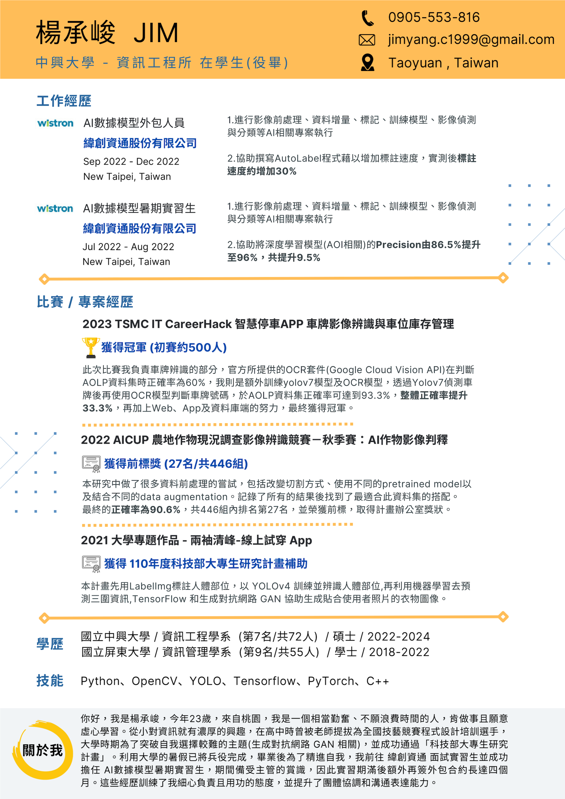

- 👋 Hi, I’m @jim
- 👀 I’m interested in python and C++
- 🌱 I’m currently learning data structure and Deep learning
- 📫 Jim_Yang_C@smail.nchu.edu.tw

| 日期 | 經歷 | 備註 |
| --- | --- | --- |
| 2023.7-2023.8 | 台積電 IT實習生(DevOps) (為期兩個月) | [Link](https://sites.google.com/view/jim-yang/%E6%A5%8A%E6%89%BF%E5%B3%BB-%E5%80%8B%E4%BA%BA%E7%B6%B2%E9%A0%81/2023-tsmc-it-intern?authuser=0) |
| 2023.8.11 | 台積電 IT INTERN HACKATHON 獲得 **第三名(共十組)** | [Link](https://sites.google.com/view/jim-yang/%E6%A5%8A%E6%89%BF%E5%B3%BB-%E5%80%8B%E4%BA%BA%E7%B6%B2%E9%A0%81/2023-tsmc-it-intern?authuser=0#h.wl9x1upbwqrg) |
| 2023.2.11 | TSMC IT CareerHack 智慧停車 APP 車牌影像辨識與車位庫存管理 **冠軍 (初試約500人)** | [Link](https://sites.google.com/view/jim-yang/%E6%A5%8A%E6%89%BF%E5%B3%BB-%E5%80%8B%E4%BA%BA%E7%B6%B2%E9%A0%81/2023-tsmc-it-careerhack-%E6%99%BA%E6%85%A7%E5%81%9C%E8%BB%8A-app-%E8%BB%8A%E7%89%8C%E5%BD%B1%E5%83%8F%E8%BE%A8%E8%AD%98%E8%88%87%E8%BB%8A%E4%BD%8D%E5%BA%AB%E5%AD%98%E7%AE%A1%E7%90%86-%E5%86%A0%E8%BB%8D?authuser=0) |
| 2023.1.9 | AICUP 農地作物現況調查影像辨識競賽：AI作物影像判釋 **獲得前標 (22名/446組)** | [Link](https://sites.google.com/view/jim-yang/%E6%A5%8A%E6%89%BF%E5%B3%BB-%E5%80%8B%E4%BA%BA%E7%B6%B2%E9%A0%81/2022-ai-cup-ai%E4%BD%9C%E7%89%A9%E5%BD%B1%E5%83%8F%E5%88%A4%E8%AD%98%E5%89%8D%E6%A8%99%E7%8D%B2%E5%BE%97%E8%A8%88%E7%95%AB%E8%BE%A6%E5%85%AC%E5%AE%A4%E7%8D%8E%E7%8B%80?authuser=0) |
| 2022.9 | 中興大學 資訊工程所 (7/72) | - |
| 2022.9-2022.12 | 緯創資通 AI數據模型外包人員 (為期四個月) | - |
| 2022.7-2022.8 | 緯創資通 AI數據模型實習生 (為期兩個月) | - |
| 2018.9-2022.6 | 屏東大學 資訊管理學系 (9/55) | [作品集](https://sites.google.com/view/jim-yang/%E6%A5%8A%E6%89%BF%E5%B3%BB-%E5%80%8B%E4%BA%BA%E7%B6%B2%E9%A0%81/%E5%A4%A7%E5%AD%B8%E6%99%82%E6%9C%9F%E4%BD%9C%E5%93%81%E9%9B%86?authuser=0) |

